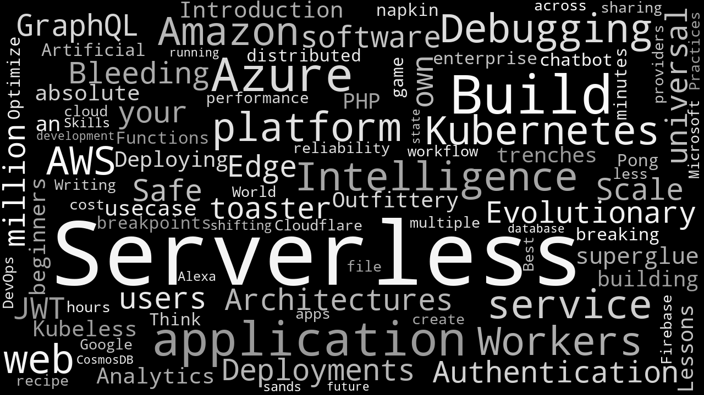

# Lambda Layers FTW!

Code examples presented at [Serverless on stage #16](https://www.meetup.com/Serverless-Italy/events/258711904/), slides [visible also here](http://www.rolandfg.net/)

**DISCLAIMER**: Automated build/deploy scripts require additional tweaking to be used in a real project (e.g. error checking)

## Node.js Demo

Lambda functions (exposed via HTTP) consuming bike-sharing API. Data provider API methods are coded in custom libraries bundled in a shared Lambda Layer.

Contents:

```shell
├── bin                     
│   ├── build.sh            # <- build script
│   └── deploy.sh           # <- build script
├── build
│   ├── code-bikemi.zip     # <- lambda function deploy package
│   ├── code-mobike.zip     # <- lambda function deploy package
│   └── layer.zip           # <- layer deploy package
├── src                     
│   ├── bikemi.js           # <- BikeMI data provider (in layer.zip)
│   ├── lambda_bikemi.js    # <- lambda consuming BikeMI API
│   ├── lambda_mobike.js    # <- lambda consuming Mobike API
│   ├── mobike.js           # <- Mobike service API wrapper (in layer.zip)
│   ├── sample-usage.js     # <- sample script
│   └── simple_bikemi.js    # <- lambda example for BikeMI API   
└── template.yml            # <- SAM template
```

Sample invocaction:

```shell
## BikeMI station near Milan Duomo (45.460951,9.188376)
$ curl 'https://slu579if63.execute-api.eu-west-3.amazonaws.com/Prod/bikemi?lat=45.460951&lng=9.188376' | jq .
[
  {
    "bikemi": [
      {
        "lng": 9.1868287,
        "lat": 45.462766,
        "name": "Santa Maria Beltrade",
        "bikes": {
          "standard": 8,
          "electric": 2,
          "babySeat": 0
        },
        "emptySlots": 13,
        "distance": 0.23514495567610313
      },
      {
        "lng": 9.1902244,
        "lat": 45.460017,
        "name": "Velasca",
        "bikes": {
          "standard": 18,
          "electric": 2,
          "babySeat": 0
        },
        "emptySlots": 4,
        "distance": 0.17767506585759438
      },
...
```      

### Requirements
- Node.js 8
- [`aws cli`](https://docs.aws.amazon.com/cli/latest/userguide/cli-chap-install.html) and
[`SAM cli`](https://docs.aws.amazon.com/serverless-application-model/latest/developerguide/serverless-sam-cli-install.html) for automated deployment

### Up and running

0. Download repo:

```
git clone git@github.com:flerro/lambda-layers-FTW.git
```


1. Build and deploy on AWS:

```
cd lambda-layers-FTW/node-demo
bin/build.sh
bin/deploy.sh
```

### Testing in AWS Console

Sample test events:

- Near Duomo:
    ```json
    {
        "queryStringParameters": {
            "lat": 45.460951, 
            "lng": 9.188376
        }
    }
    ```
- Near Mikamai:
    ```json
    {
        "queryStringParameters": {
            "lat": 45.4906, 
            "lng": 9.21538
        }
    }
    ```

## Python Demo

A word cloud generator referencing some python modules from a Lambda Layer. Input text is generated
scraping talk titles from [Serverless Days 2018](https://milan.serverlessdays.io/) agenda, Ouput image is saved in a S3 bucket.

```shell
├── bin                     
│   ├── build.sh       # <- build script
│   ├── deploy.sh      # <- deploy script
│   └── init_venv.sh   # <- virtualenv generation
├── build
│   ├── code.zip       # <- lambda function deploy package
│   └── layer.zip      # <- layer deploy package
├── src                
│   └── wc.py          # <- 
├── venv                
│   └── ...            # <- virtual environment used by build script
└── template.yml       # <- SAM template
```

Output image:



### Requirements

- Python 3.6
- External modules in `requirements.txt`
- [`aws cli`](https://docs.aws.amazon.com/cli/latest/userguide/cli-chap-install.html) and
[`SAM cli`](https://docs.aws.amazon.com/serverless-application-model/latest/developerguide/serverless-sam-cli-install.html) for automated deployment


### Up and running

0. Download repo

```
git clone git@github.com:flerro/lambda-layers-FTW.git
```

1. Install requirements in a virtual environment

```
cd lambda-layers-FTW/python-demo
virtualenv venv
source venv/bin
pip install -r requirements.txt
```

2. Build and deploy on AWS:

```
cd python-demo
bin/build.sh
bin/deploy.sh
```